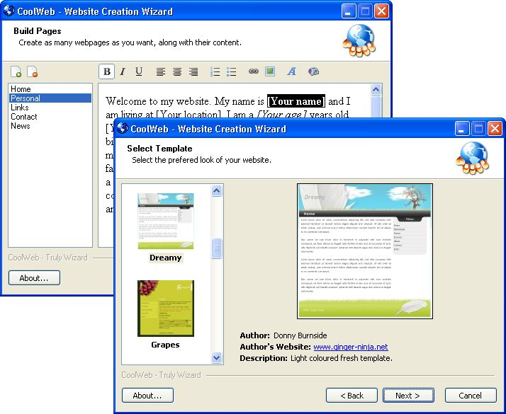

## CoolWeb  \- Website Creation Wizard \- v1\.4

### Description

CoolWeb is back! Lots of new features including Multi-lingual and Maximizable GUI. CoolWeb is a powerful and easy-to-use website creation wizard. CoolWeb will enable you to build professional-looking websites within minutes. With support for templates, CoolWeb is powerful enough to create different modern-looking websites for you. It includes 15 outstanding templates with compact code and more templates can be added quite easily. CoolWeb comes with CoolTemplates a Template Creation Wizard which enables you to create templates very easily. Aside from templates, CoolWeb also focuses on time taken to build a site. It will take about only 10 minutes to create your ready-to-publish website. By using the term "ready-to-publish", I mean that if you designed your website the way you want in CoolWeb, you do not need to make any changes in order to publish it on the web. Just build and publish! CoolWeb also supports "Projects" so that you can continue from where you last left off.

With CoolWeb, creating websites is truly visual. Select templates visually, add and delete pages visually and format your text visually. If you are in a little hurry, and do not have time to write text for your website, CoolWeb also includes some predefined-pages for you. It couldn't have been easier than that! More predefined-pages can be added easily, just drop them in the "pages" folder.
 
### More Info
 

             |
---                |---
**Submitted On**   |2007-05-05 14:15:20
**By**             |[Agam Saran](https://github.com/Planet-Source-Code/PSCIndex/blob/master/ByAuthor/agam-saran.md)
**Level**          |Intermediate
**User Rating**    |4.9 (401 globes from 82 users)
**Compatibility**  |VB 5\.0, VB 6\.0
**Category**       |[Complete Applications](https://github.com/Planet-Source-Code/PSCIndex/blob/master/ByCategory/complete-applications__1-27.md)
**World**          |[Visual Basic](https://github.com/Planet-Source-Code/PSCIndex/blob/master/ByWorld/visual-basic.md)
**Archive File**   |[CoolWeb\_\_\-206419552007\.zip](https://github.com/Planet-Source-Code/agam-saran-coolweb-website-creation-wizard-v1-4__1-67856/archive/master.zip)

